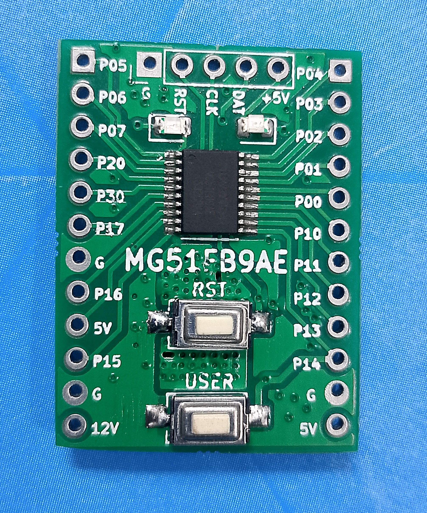
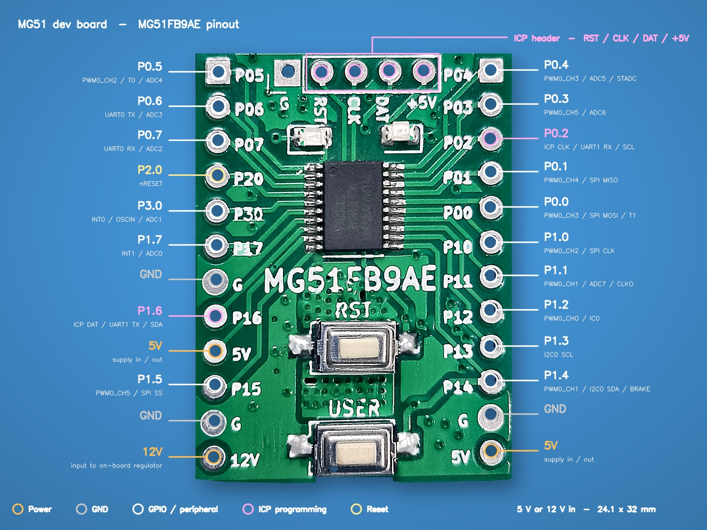

# Micronode MG51 Dev Board

A compact 8051 development board built around the Nuvoton **MS51FB9AE** (TSSOP-20), designed and manufactured in India by [Micronode LLP](https://micronode.in), Pune.



The Nuvoton 1T 8051 is widely used in production — LED lighting and drivers, appliances, motor control, power supplies and other cost-sensitive industrial builds, as well as long-running legacy 8051 designs. This board gives you that same MCU on a small, breadboard-friendly carrier for evaluation, firmware bring-up and prototyping before you commit to your own PCB. It works equally well for 8051 course work and lab use.

---

## Features

- Nuvoton MS51FB9AE 1T 8051 microcontroller, TSSOP-20
- Board size: **24.1 x 32 mm**
- Powered through the header pins — accepts **5 V or 12 V** input
- **USER button** on `P1.4`
- **Blue user LED** on `P0.5`
- **Red power LED**
- All usable I/O broken out on 2.54 mm headers, breadboard friendly
- Programmed over standard Nuvoton ISP
- Works with **SDCC** (open source) and **Keil C51**

## What's not on the board

This is a bare development board. Be aware before you buy:

- **No on-board programmer or debugger** — you need an external Nuvoton ISP programmer (Nu-Link) or a USB-to-serial adapter for ISP
- **No USB connector** — power and programming come in through the headers
- No on-board crystal 

## Specifications

| | |
|---|---|
| MCU | Nuvoton MS51FB9AE, TSSOP-20 |
| Core | 1T 8051 |
| Operating voltage (MCU) | 5 V (from on-board regulator) |
| Input voltage | 5 V or 12 V via header pins |
| Dimensions | 24.1 x 32 mm |

## Pinout



## Getting started

Power the board by applying 5 V or 12 V to the power pins on the header — the red power LED lights up. Connect an external Nuvoton ISP programmer to the programming pins, build your firmware in SDCC or Keil C51, and flash the `.hex` using Nuvoton's ISP Programming Tool.

Full step-by-step instructions and code examples are in the **Getting Started** guide: [`Getting Started/`](Getting%20Started/)

## Repository contents

```
Docs/              Datasheet, schematic, pinout
Getting Started/   Setup guide and code examples
Images/            Board photographs and pinout diagram
```

## Where to buy

Available from [micronode.in](https://micronode.in) at **Rs. 295 (inclusive of GST)**.

## Support

Questions about the hardware or firmware? Open an issue on this repository, or write to us:

- info@micronode.in
- micronode.in@gmail.com

## Licence

MIT — see [`LICENSE`](LICENSE).

---

Designed and manufactured in India by **Micronode LLP**, Pune.
